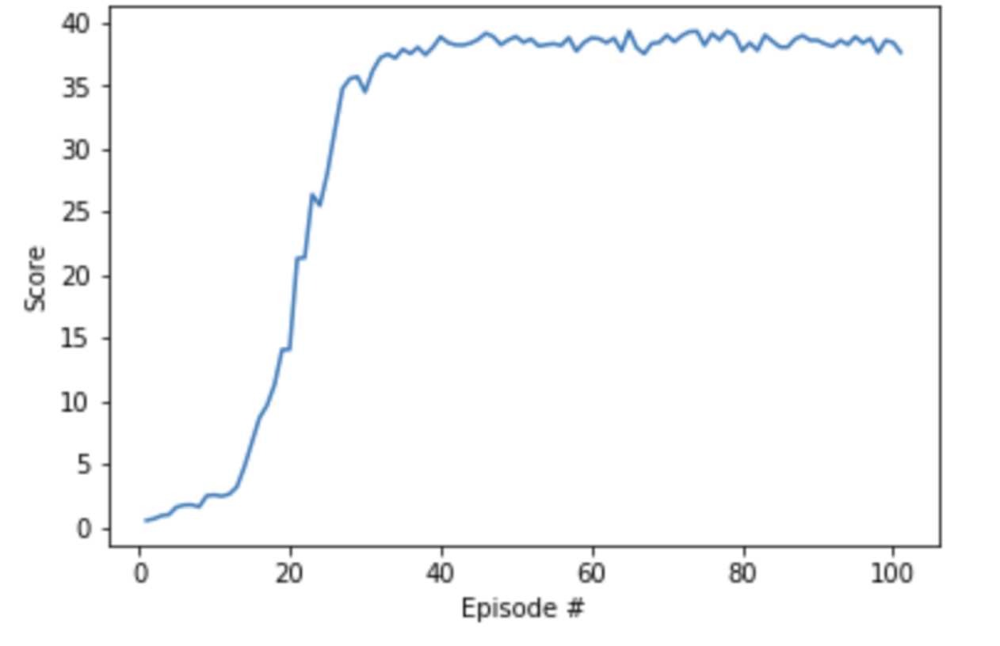

# Udacity Deep Reinforcement Learning - Continuous Control Project.

## Environment

In this environment, a double-jointed arm can move to target locations. A reward of +0.1 is provided for each step that 
the agent's hand is in the goal location. Thus, the goal of your agent is to maintain its position at the target location 
for as many time steps as possible.

The observation space consists of 33 variables corresponding to position, rotation, velocity, and angular velocities of the arm. 
Each action is a vector with four numbers, corresponding to torque applicable to two joints.  Every entry in the action 
vector should be a number between -1 and 1.

## Agent

The agent used for this project is a modified version of the [BipedalWalker](https://github.com/udacity/deep-reinforcement-learning/tree/master/ddpg-bipedal) 
tutorial provided by the Udacity in their Deep RL nano-degree, which makes use of [DDPG](https://arxiv.org/abs/1509.02971) agent.

Deterministic Policy Gradients is an Actor-Critic method that that has a nice property of being off-policy. DDPG belongs
to the A2C family, but with the deterministic policy which means that it directly provides us with the action to take from
the state. This means that we can directly improving the policy by maximsing the Q-Value.

DDPG is considered to be an an Actor-Critic method.
* The actor takes in the State and directly maps it to the Action, which is scaled from -1 to 1, so it could account for continuity.
* The critic accepts two values, the current state and the action from the actor network. It concatenates them together
and outputs a single number which corresponds to the Q-Value.

I used a number of techniques to enhance the vanilla DDPG agent and also make it more stable.
First of all, I opted a second version of Unity environment that provided 20 independent environmental agents and supplied
the all of the states to the single DDPG agent with a single rewply buffer. This was done to increase the number of observations
in the reply buffer and with addition to a large batch size of 1024 observations has forced the agent to lear quicker.

In order to make the training more stable I chose to update the agents 10 times in every 20 timestamps as suggested by the
course instructors.


## Model Architecture

The model consists of thetow separate neural netowrks for actor and the critic and it follows the architecture from 
[Continuous control with deep reinforcement learning](https://arxiv.org/abs/1509.02971) paper, with te addition of a single
Batch Normalisation layer for both the Actor and the Critic, which proved to help with the training speed and stability.

### Actor Model

The actor model is a simple feed forward neural network with 3 fully connected (FC) layers followed by a ReLU activation function.
Th first layer is also followed by the batch normalisation layer. The final FC layer has an output dimension corresponding
to thje action size, which is transformed by the TanH activation function in order to scale the output from -1 to 1.

The model Layers are as following:
```
input layer:  in 33  out 400
batch norm: 400
ReLU
hidden layer: in 400  out 300
ReLU
output layer: in 300 out 4
TanH
```

### Critic Model

The Critic model is also a feed forward neural network with 3 fully connected (FC) layers, however it is a bit unusual because
it has two separate paths for the state observations and the actions from the Actor model which are concatenated with
the states in the second layer.
```
input layer:  in 33  out 400
batch norm: 400
ReLU
hidden layer: in 400 + 4  out 300
ReLU
output layer: in 300 out 1
```

### Hyper Parameters

```
BUFFER_SIZE = int(1e6)  # replay buffer size
BATCH_SIZE = 1024       # minibatch size
GAMMA = 0.99            # discount factor
TAU = 1e-3              # for soft update of target parameters
LR_ACTOR = 1e-3         # learning rate of the actor 
LR_CRITIC = 1e-3        # learning rate of the critic
WEIGHT_DECAY = 0.000    # L2 weight decay
```

## Results

The model has performed very well, reaching the score of 30 by 30th Episode and reaching the average score of 30 over the
past 100 episodes by the 101 episode.




## Future work

Distributed Learning with D4PG.

Form the future work I will take the advantage of the DDistributed training environment and will use the D4PG
agent, which improves convergence, stability and sample efficiency.

